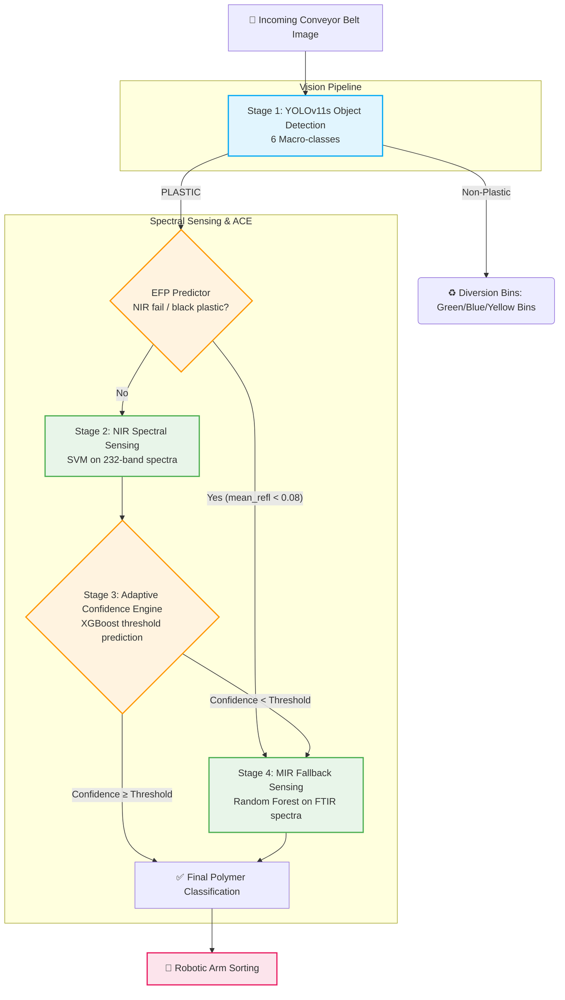

# ♻️ AI + Sensor Based Plastic Waste Sorting System
### *Featuring the Adaptive Confidence Engine (ACE)*

[](https://www.python.org/downloads/release/python-3140/)
[](https://github.com/ultralytics/ultralytics)
[](https://xgboost.readthedocs.io/)
[](https://opensource.org/licenses/MIT)

A multimodal waste segregation system integrating deep learning computer vision with spectral sensing (NIR + MIR). The system introduces a novel **Adaptive Confidence Engine (ACE)** for intelligent sensor cascade management, significantly reducing energy consumption while maintaining peak sorting accuracy.

---

## 🌟 Key Highlights

- **🎯 Macro-Class Visual Sorting** across 6 categories (`BIODEGRADABLE`, `CARDBOARD`, `GLASS`, `METAL`, `PAPER`, `PLASTIC`) using YOLOv11s.
- **🔍 97.12% NIR Spectral Identification** accuracy for primary polymer typing using SVM on 232-band spectra.
- **🖤 100% MIR Identification Accuracy** on pure spectral samples (`PET`, `HDPE`, `PVC`, `LDPE`, `PP`, `PS`) using Random Forest / SVM classifiers.
- **📈 Adaptive Confidence Engine (ACE)** trained on 17 features achieving 99.8% threshold prediction accuracy.
- **🔋 Proactive Expected Failure Prediction (EFP)** model (ROC-AUC 1.00) bypassing 13.8% of items (seeded by mean reflectance < 0.08 black plastic gate) straight to MIR.

---

## 🏗️ System Architecture

The project features a highly optimized, cascaded pipeline combining visual and spectral modalities. 



### Stage Breakdown
1. **Stage 1 — Vision Detection:** YOLOv11s detects waste objects on the conveyor belt and classifies them into 6 macro-classes.
2. **Expected Failure Predictor (EFP):** Ingests visual properties (e.g. darkness, gloss) and fast preliminary NIR mean intensity. If it predicts an NIR failure (e.g., carbon-black absorbing plastics, where mean reflectance < 0.08), it bypasses the NIR stage entirely.
3. **Stage 2 — NIR Spectral Sensing:** Employs an SVM classifier on 232-band NIR spectra for primary polymer typing.
4. **Stage 3 — Adaptive Confidence Engine (ACE):** An XGBoost model dynamically determines if the costly MIR sensor is required based on a 17-feature context vector.
5. **Stage 4 — MIR Fallback:** High-precision FTIR spectra analyzed by a Random Forest model, specifically targeted at black or heavily contaminated plastics (100% accuracy on pure samples).

---

## 📁 Project Structure

```text
├── src/
│   ├── ace/                          # Adaptive Confidence Engine
│   │   ├── engine.py                 # Core ACE (XGBoost wrapper)
│   │   ├── feature_extractor.py      # 17-feature context vector extractor
│   │   ├── synthetic_data.py         # Physics-based data generator
│   │   ├── feedback_db.py            # SQLite feedback loop
│   │   ├── train_ace.py              # Train ACE on synthetic data
│   │   └── evaluate_ace.py           # ACE vs Fixed Threshold comparison
│   ├── detect.py                     # YOLOv11s single-frame webcam inference
│   └── unified_pipeline.py           # Grand Unified sorting pipeline with real MIR models
├── Atharva_NIR/                      # Spectral Sensing Track
│   ├── preprocess.py                 # SNV Normalization + Savgol filtering
│   ├── train_classical.py            # MIR classifier training (RF, SVM, XGBoost)
│   ├── results/                      # Validation logs & paper metrics
│   └── models/                       # Pre-trained MIR/NIR pickle models & scalers
├── docs/                             # Documentation and Reports
│   ├── PAPER_ALIGNMENT.md            # Patent/Paper vs Code verification tracker
│   └── efp_report.md                 # Expected Failure Predictor training report
├── requirements.txt                  # Python dependencies
└── README.md                         # Project documentation
```

---

## 🛠️ Installation & Setup

### Prerequisites
- Python 3.14+
- `scikit-learn`, `xgboost`, `opencv-python`, `scipy`, `pandas`, `joblib`

### Setup
```bash
# Create and activate virtual environment
python -m venv venv
venv\Scripts\activate      # Windows

# Install Dependencies
pip install -r requirements.txt
```

---

## 🚀 Usage

### 1. Run the Unified Segregation Pipeline
To run the end-to-end multimodal cascade demo using real MIR spectra from validation splits:
```bash
python -m src.unified_pipeline
```

### 2. Retrain EFP Model
```bash
python scripts/train_efp_model.py
```

### 3. Retrain ACE Engine
```bash
python -m src.ace.train_ace
```

---

## 📖 Citation

If you use this code or the ACE methodology in your research, please cite our IEEE paper draft:

```bibtex
@inproceedings{author2026ace,
  title={Adaptive Confidence Engine for Energy-Efficient Multimodal Plastic Waste Sorting},
  author={Placeholder, Author},
  booktitle={IEEE International Conference on Robotics and Automation (ICRA)},
  year={2026},
  organization={IEEE}
}
```
