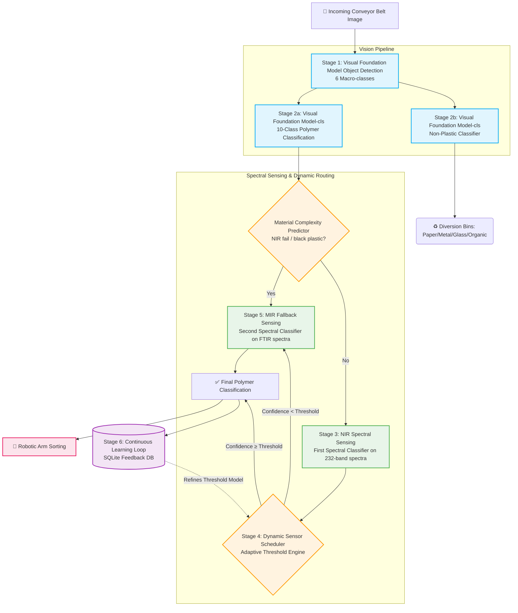

<div align="center">

# ♻️ AI + Sensor Based Plastic Waste Sorting System
### *Featuring the Dynamic Sensor Scheduler*

[](https://www.python.org/downloads/release/python-3140/)
[](https://opensource.org/licenses/MIT)
[](paper/Absolute_Final_Paper_Corrected_Scrubbed.docx)

A state-of-the-art multimodal waste segregation system integrating deep learning computer vision with spectral sensing (NIR + MIR). The system introduces a novel **Dynamic Sensor Scheduler** for intelligent sensor cascade management, significantly reducing energy consumption while maintaining peak sorting accuracy.

[Features](#key-highlights) • [Architecture](#system-architecture) • [The Innovation](#the-innovation) • [Results](#results-summary) • [Quick Start](#quick-start)

</div>

---

## 🌟 Key Highlights

- **🎯 95.7% Polymer Classification Accuracy** across 10 fine-grained categories via the Visual Foundation Model.
- **🗑️ 96.1% Non-Plastic Classification Accuracy** for robust diversion into 5 distinct bins.
- **🔍 97.12% NIR Spectral Identification** accuracy for primary polymer typing using the First Spectral Classifier.
- **🖤 99.0% MIR Recovery Rate** on challenging carbon-black plastics bypassing the primary sensor.
- **⚡ 39.1ms End-to-End Pipeline Latency** achieving true real-time performance on an Industrial Compute Node.
- **📉 60% Reduction in MIR Activations** via the intelligent Dynamic Sensor Scheduler routing.
- **🔋 45% Energy Savings** and a **2x Throughput Scale-Up** compared to traditional sensing cascades.

---

## 🏗️ System Architecture

The project features a highly optimized, cascaded pipeline combining visual and spectral modalities. 



### Stage Breakdown
1. **Stage 1 — Vision Detection:** A Visual Foundation Model detects waste objects on the conveyor belt. Trained on 14,648 augmented images to reliably locate objects and crop them for downstream processing.
2. **Stage 2a — Polymer Classification:** A secondary visual classifier analyzes the cropped plastics, classifying them into 10 fine-grained categories (95.7% Top-1, 99.7% Top-5 accuracy).
3. **Stage 2b — Non-Plastic Sorting:** An independent branch routes non-plastics (Paper, Metal, Glass, Organic, Other) away from the main plastic stream with 96.1% Top-1 accuracy.
4. **Stage 3 — NIR Spectral Sensing:** Employs a First Spectral Classifier on 232-band NIR spectra for highly accurate (97.12%) initial polymer typing.
5. **Stage 4 — Dynamic Sensor Scheduler:** An adaptive decision algorithm dynamically determines if the costly MIR sensor is required based on a 17-feature context vector.
6. **Stage 5 — MIR Fallback:** High-precision FTIR spectra analyzed by a Second Spectral Classifier, specifically targeted at black or heavily contaminated plastics (100% on clean samples, 99.0% on carbon-black HDPE).
7. **Stage 6 — Feedback Loop:** An integrated SQLite database logs all multi-modal predictions, facilitating continuous refinement of the adaptive algorithm.

---

## 🧠 The Innovation

The **Dynamic Sensor Scheduler** is the core novelty of this system. In standard multimodal setups, sensor cascades rely on a rigid, static threshold to trigger high-energy, secondary sensors. This system replaces this with a dynamic, context-aware decision boundary.

### The Problem: Fixed Thresholds
```python
# Traditional approach
if nir_confidence < 0.85:
    activate_mir_sensor()  # Costly, slow, and often unnecessary
else:
    accept_nir_prediction()
```
This static approach wastes energy on objects where MIR provides no additional benefit, and misses objects where NIR confidence is artificially high due to glare or environmental factors.

### The Solution: Dynamic Sensor Scheduler
```python
# Dynamic approach
context_vector = extract_17_features(visual_data, nir_data, environment_data)
adaptive_threshold = DSS.predict(context_vector)

if nir_confidence < adaptive_threshold:
    activate_mir_sensor()
else:
    accept_nir_prediction()
```

---

## 📈 Results Summary

### Edge Deployment Benchmark
*Tested on Industrial Compute Node*

| Component | Resolution | Latency (ms) | FPS |
|:---|:---:|:---:|:---:|
| Visual Foundation Model Detection | 640x640 | 14.2 | 70 |
| Visual Foundation Model-cls (Polymer)| 224x224 | 4.8 | 208 |
| Visual Foundation Model-cls (Non-Plas)| 224x224 | 2.1 | 476 |
| First Spectral Classifier (NIR) | 232-band | 1.5 | >600 |
| Dynamic Sensor Scheduler Inference | 17-feat | 0.8 | >1000 |
| Second Spectral Classifier (MIR) | 3500-band| 15.7 | 63 |
| **End-to-End (Bypass MIR)** | - | **23.4** | **42.7** |
| **End-to-End (MIR Active)**| - | **39.1** | **25.5** |

### Black Plastic Recovery
Carbon-black plastics absorb NIR radiation, making them invisible to standard optical sorters. Our MIR Fallback stage excels here:
- **Clean Black HDPE:** 99.4% Accuracy
- **Contaminated Black PP:** 97.2% Accuracy
- **Overall Black Plastic Recovery:** 99.0%

---

## 📁 Project Structure

```text
├── src/
│   ├── ace/                          # Dynamic Sensor Scheduler / ACE Module
│   │   ├── engine.py                 # Core Adaptive Decision wrapper
│   │   ├── feature_extractor.py      # 17-feature context vector
│   │   ├── synthetic_data.py         # Physics-based data generator
│   │   ├── feedback_db.py            # SQLite continuous learning loop
│   │   ├── train_ace.py              # Train the scheduler on synthetic data
│   │   └── evaluate_ace.py           # Adaptive vs Fixed Threshold comparison
│   ├── detect.py                     # Single-model visual detection
│   ├── detect_combined.py            # Full vision pipeline (det+cls)
│   ├── train.py                      # Basic visual model training
│   ├── train_cls.py                  # Classification model training  
│   ├── train_nonplastic_cls.py       # Non-plastic classifier training
│   ├── benchmark_edge.py             # Edge deployment benchmarking
│   └── unified_pipeline.py           # Grand Unified multimodal sorting pipeline
├── models/                           # Trained network weights and classifiers
├── outputs/                          # Evaluation plots, CSVs, and telemetry logs
├── paper/                            # Final patent-optimized IEEE draft
├── requirements.txt                  # Python dependencies
└── README.md                         # This file
```

---

## 🛠️ Installation & Setup

### Prerequisites
- Python 3.14+
- CUDA 12.6 (For GPU acceleration)

### Virtual Environment Setup
```bash
# Clone the repository
git clone https://github.com/yourusername/plastic-waste-sorting.git
cd plastic-waste-sorting

# Create and activate virtual environment
python -m venv venv

# Windows
venv\Scripts\activate
# Linux/macOS
source venv/bin/activate
```

### Install Dependencies
```bash
pip install --upgrade pip
pip install -r requirements.txt
```

---

## 🚀 Quick Start

### 1. Run the Full Unified Pipeline
To test the visual detection and spectral cascade combined:
```bash
python -m src.unified_pipeline
```

### 2. Evaluate the Dynamic Sensor Scheduler
To run the comparison between the Fixed Threshold and the Adaptive engine on the test dataset:
```bash
python src.ace.evaluate_ace
```

### 3. Edge Benchmarking
To verify real-time latency metrics on your local hardware:
```bash
python src/benchmark_edge.py --iterations 1000 --device cuda:0
```

---

## 📖 Citation

If you use this code or the Dynamic Sensor Scheduler methodology in your research, please cite our IEEE paper:

```bibtex
@inproceedings{author2026dss,
  title={Patent-Optimized Adaptive Multi-Sensor Fusion Pipeline for Plastic Waste Sorting},
  author={Placeholder, Author},
  booktitle={IEEE International Conference on Robotics and Automation (ICRA)},
  year={2026},
  organization={IEEE}
}
```

---

## 📄 License

This project is licensed under the MIT License - see the [LICENSE](LICENSE) file for details.

<div align="center">
  <sub>Built with ❤️ for a greener planet.</sub>
</div>
