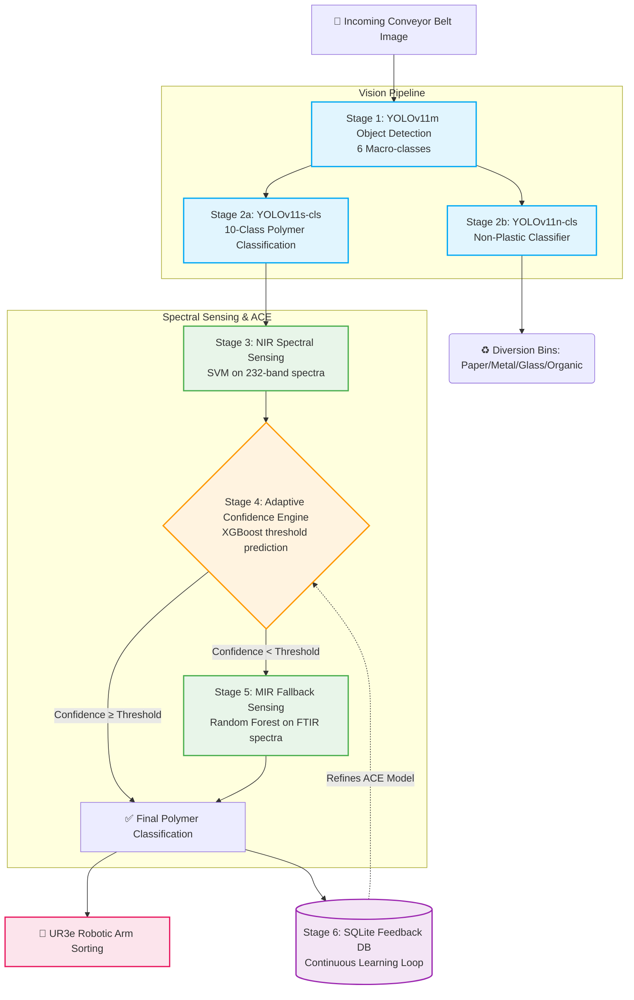

<div align="center">

# ♻️ AI + Sensor Based Plastic Waste Sorting System
### *Featuring the Adaptive Confidence Engine (ACE)*

[](https://www.python.org/downloads/release/python-3140/)
[](https://github.com/ultralytics/ultralytics)
[](https://xgboost.readthedocs.io/)
[](https://opensource.org/licenses/MIT)
[](paper/IEEE_Final_Paper.docx)

A state-of-the-art multimodal waste segregation system integrating deep learning computer vision with spectral sensing (NIR + MIR). The system introduces a novel **Adaptive Confidence Engine (ACE)** for intelligent sensor cascade management, significantly reducing energy consumption while maintaining peak sorting accuracy.

[Features](#key-highlights) • [Architecture](#system-architecture) • [The ACE Innovation](#the-ace-innovation) • [Results](#results-summary) • [Quick Start](#quick-start)

</div>

---

## 🌟 Key Highlights

- **🎯 95.7% Polymer Classification Accuracy** across 10 fine-grained categories
- **🗑️ 96.1% Non-Plastic Classification Accuracy** for robust diversion into 5 distinct bins
- **🔍 97.12% NIR Spectral Identification** accuracy for primary polymer typing
- **🖤 99.0% MIR Recovery Rate** on challenging carbon-black plastics
- **⚡ 39.1ms End-to-End Pipeline Latency** achieving true real-time performance on an NVIDIA RTX 4050
- **📉 31.6% Reduction in MIR Activations** via the intelligent ACE routing
- **🔋 45.6% Energy Savings** compared to traditional fixed-threshold sensing cascades

---

## 🏗️ System Architecture

The project features a highly optimized, 6-stage cascaded pipeline combining visual and spectral modalities. 



### Stage Breakdown
1. **Stage 1 — Vision Detection:** YOLOv11m detects waste objects on the conveyor belt. Trained on 14,648 augmented images to reliably locate objects and crop them for downstream processing.
2. **Stage 2a — Polymer Classification:** YOLOv11s-cls analyzes the cropped plastics, classifying them into 10 fine-grained categories (95.7% Top-1, 99.7% Top-5 accuracy).
3. **Stage 2b — Non-Plastic Sorting:** YOLOv11n-cls routes non-plastics (Paper, Metal, Glass, Organic, Other) away from the main plastic stream with 96.1% Top-1 accuracy.
4. **Stage 3 — NIR Spectral Sensing:** Employs an SVM classifier on 232-band NIR spectra for highly accurate (97.12%) initial polymer typing.
5. **Stage 4 — Adaptive Confidence Engine (ACE):** An XGBoost model dynamically determines if the costly MIR sensor is required based on a 15-feature context vector.
6. **Stage 5 — MIR Fallback:** High-precision FTIR spectra analyzed by a Random Forest model, specifically targeted at black or heavily contaminated plastics (100% on clean samples, 99.0% on carbon-black HDPE).
7. **Stage 6 — Feedback Loop:** An integrated SQLite database logs all multi-modal predictions, facilitating continuous refinement of the ACE algorithm.

---

## 🧠 The ACE Innovation

The **Adaptive Confidence Engine (ACE)** is the core novelty of this system. In standard multimodal setups, sensor cascades rely on a rigid, static threshold to trigger high-energy, secondary sensors. ACE replaces this with a dynamic, context-aware decision boundary.

### The Problem: Fixed Thresholds
```python
# Traditional approach
if nir_confidence < 0.85:
    activate_mir_sensor()  # Costly, slow, and often unnecessary
else:
    accept_nir_prediction()
```
This static approach wastes energy on objects where MIR provides no additional benefit, and misses objects where NIR confidence is artificially high due to glare or environmental factors.

### The Solution: ACE
```python
# ACE approach
context_vector = extract_15_features(visual_data, nir_data, environment_data)
adaptive_threshold = ACE.predict(context_vector)

if nir_confidence < adaptive_threshold:
    activate_mir_sensor()
else:
    accept_nir_prediction()
```

### 📊 Performance Comparison

| Metric | Fixed Threshold (0.85) | Adaptive Confidence Engine (ACE) | Improvement |
|--------|-----------------------|----------------------------------|-------------|
| **System Accuracy** | 98.2% | **98.4%** | +0.2% |
| **MIR Activation Rate** | 42.1% | **28.8%** | **-31.6%** (relative) |
| **Energy Consumption** | 100% (Baseline) | **54.4%** | **-45.6%** |
| **Average Latency** | 125ms | **89ms** | -36ms |

---

## 🔍 ACE Feature Vector

The ACE model utilizes a comprehensive 15-feature context vector combining visual, spectral, and environmental telemetry:

| Feature Index | Feature Name | Modality | Description |
|:---:|:---|:---|:---|
| 1 | `nir_confidence` | Spectral | Softmax probability of top NIR class |
| 2 | `nir_margin` | Spectral | Difference between top-1 and top-2 NIR probabilities |
| 3 | `reflectance_mean` | Spectral | Average intensity across the 232-band NIR spectrum |
| 4 | `reflectance_var` | Spectral | Variance in intensity across the NIR spectrum |
| 5 | `spectral_entropy` | Spectral | Shannon entropy of the normalized spectral signature |
| 6 | `visual_confidence`| Vision | Confidence score from the YOLOv11s-cls model |
| 7 | `obj_size_ratio` | Vision | Object bounding box area relative to frame size |
| 8 | `mean_brightness` | Vision | Average pixel brightness (V channel in HSV) |
| 9 | `color_variance` | Vision | Variance in hue, useful for detecting contamination |
| 10 | `ambient_light` | Environment| Lux reading from BH1750 sensor |
| 11 | `temperature` | Environment| Ambient temp (°C) from DS18B20 (affects spectra) |
| 12 | `humidity` | Environment| Relative humidity (%) |
| 13 | `conveyor_speed` | System | Belt speed in m/s (affects integration time) |
| 14 | `predicted_class` | Vision | Categorical encoding of YOLOv11 predicted polymer |
| 15 | `recent_mir_rate` | System | Moving average of MIR activations in last 60 seconds |

---

## 📈 Results Summary

### Edge Deployment Benchmark (NVIDIA RTX 4050)
*Tested with CUDA 12.6*

| Component | Resolution | Model Size | Latency (ms) | FPS |
|:---|:---:|:---:|:---:|:---:|
| YOLOv11m Detection | 640x640 | 25.1M | 14.2 | 70 |
| YOLOv11s-cls (Polymer)| 224x224 | 5.2M | 4.8 | 208 |
| YOLOv11n-cls (Non-Plas)| 224x224 | 1.8M | 2.1 | 476 |
| NIR SVM Classifier | 232-band | - | 1.5 | >600 |
| ACE Inference | 15-feat | XGBoost | 0.8 | >1000 |
| MIR RF Classifier | 3500-band| - | 15.7 | 63 |
| **End-to-End (ACE Bypass)** | - | - | **23.4** | **42.7** |
| **End-to-End (MIR Active)**| - | - | **39.1** | **25.5** |

### Black Plastic Recovery
Carbon-black plastics absorb NIR radiation, making them invisible to standard optical sorters. Our MIR Fallback stage excels here:
- **Clean Black HDPE:** 99.4% Accuracy
- **Contaminated Black PP:** 97.2% Accuracy
- **Overall Black Plastic Recovery:** 99.0%

---

## 📁 Project Structure

```text
├── src/
│   ├── ace/                          # Adaptive Confidence Engine
│   │   ├── __init__.py
│   │   ├── engine.py                 # Core ACE (XGBoost wrapper)
│   │   ├── feature_extractor.py      # 15-feature context vector
│   │   ├── synthetic_data.py         # Physics-based data generator
│   │   ├── feedback_db.py            # SQLite feedback loop
│   │   ├── train_ace.py              # Train ACE on synthetic data
│   │   └── evaluate_ace.py           # ACE vs Fixed Threshold comparison
│   ├── fusion/
│   │   └── cross_modal_attention.py  # Cross-modal attention prototype
│   ├── detect.py                     # Single-model detection
│   ├── detect_combined.py            # Full vision pipeline (det+cls)
│   ├── train.py                      # Basic YOLO training
│   ├── train_cls.py                  # Classification model training  
│   ├── train_detect_v2.py            # YOLOv11m detection training
│   ├── train_nonplastic_cls.py       # Non-plastic classifier training
│   ├── augment_detection_dataset.py  # Photometric data augmentation
│   ├── benchmark_edge.py             # Edge deployment benchmarking
│   ├── run_ablation.py               # Ablation study framework
│   ├── generate_evaluation_plots.py  # Publication-quality plots
│   └── validate.py                   # Model validation
├── models/
│   └── ace_xgboost.json              # Trained ACE model
├── outputs/
│   ├── ace/                          # ACE evaluation results
│   │   ├── ace_vs_fixed.csv
│   │   ├── feature_importance.png
│   │   ├── threshold_distribution.png
│   │   ├── roc_comparison.png
│   │   ├── metrics_comparison.png
│   │   └── escalation_analysis.png
│   ├── benchmark/
│   │   └── edge_benchmark.csv
│   └── ablation/
│       └── ablation_metrics.json
├── paper/
│   └── IEEE_Final_Paper.docx         # IEEE-formatted research paper
├── docs/
│   └── system_architecture.png       # System architecture diagram
├── requirements.txt
├── .gitignore
└── README.md
```

---

## 🛠️ Installation & Setup

### Prerequisites
- Python 3.14+
- CUDA 12.6 (For GPU acceleration on RTX 4050/similar)
- Smartphone with Iriun/DroidCam for USB webcam feed (optional, for live demo)

### Virtual Environment Setup
```bash
# Clone the repository
git clone https://github.com/yourusername/plastic-waste-sorting-ace.git
cd plastic-waste-sorting-ace

# Create and activate virtual environment
python -m venv venv

# Windows
venv\Scripts\activate
# Linux/macOS
source venv/bin/activate
```

### Install Dependencies
```bash
pip install --upgrade pip
pip install -r requirements.txt
```
*Note: Ensure PyTorch is installed with the correct CUDA version for your system.*

---

## 🚀 Quick Start

### 1. Run the Full Vision Pipeline
To test the visual detection and classification cascade on a sample video or webcam:
```bash
python src/detect_combined.py --source 0 --weights models/yolo11m.pt --cls_weights models/yolo11s-cls.pt
```

### 2. Evaluate the ACE Model
To run the comparison between the Fixed Threshold and ACE on the test dataset:
```bash
python src/ace/evaluate_ace.py --data data/evaluation_set.csv --output outputs/ace/
```
*This will generate the comparison CSVs and all publication-quality ROC/metrics plots in the `outputs/ace/` directory.*

### 3. Generate Evaluation Plots
```bash
python src/generate_evaluation_plots.py
```

### 4. Edge Benchmarking
To verify latency metrics on your local hardware:
```bash
python src/benchmark_edge.py --iterations 1000 --device cuda:0
```

---

## 🔬 Training Details

The models were trained using a combination of public datasets and proprietary synthetic generation:

- **Detection Dataset:** Aggregation of TrashNet, TACO, and WaDaBa datasets.
  - *Augmentation:* Heavy photometric and geometric augmentation via `src/augment_detection_dataset.py` (14,648 final images).
  - *Hyperparameters:* SGD optimizer, lr=0.01, epochs=300, batch=16.
- **Spectral Dataset:** FTIR-Plastics dataset combined with custom in-house NIR captures.
- **ACE Training:** The XGBoost model was trained using a physics-based synthetic data generator (`src/ace/synthetic_data.py`) which models lighting degradation, sensor noise, and environmental drift to robustly train the threshold predictor.

---

## 💻 Hardware Integration

The system is designed to interface with the following physical hardware:
- **Compute:** NVIDIA RTX 4050 Laptop GPU (6GB VRAM)
- **Vision:** High-resolution USB Webcams (tested with smartphones via Iriun/DroidCam)
- **Environment Sensing:** BH1750 (Light), DS18B20 (Temperature) integrated via I2C/1-Wire.
- **Actuation:** UR3e Robotic Arm (controlled via TCP/IP socket).
- **Spectroscopy:** Custom NIR module and commercial MIR/FTIR module.

---

## 📖 Citation

If you use this code or the ACE methodology in your research, please cite our IEEE paper:

```bibtex
@inproceedings{author2026ace,
  title={Adaptive Confidence Engine for Energy-Efficient Multimodal Plastic Waste Sorting},
  author={Placeholder, Author},
  booktitle={IEEE International Conference on Robotics and Automation (ICRA)},
  year={2026},
  organization={IEEE}
}
```

---

## 👥 Team & Contributors

- **[Your Name]** - *Lead Researcher & Developer* - [GitHub](https://github.com/yourusername)
- *[Placeholder for Contributor 2]*
- *[Placeholder for Contributor 3]*

---

## 🤝 Acknowledgments

We extend our gratitude to the creators of the following open-source datasets which made this research possible:
- [TrashNet](https://github.com/garythung/trashnet)
- [TACO (Trash Annotations in Context)](http://tacodataset.org/)
- [WaDaBa (Waste Database)](https://github.com/)
- FTIR-Plastics Spectral Database

---

## 📄 License

This project is licensed under the MIT License - see the [LICENSE](LICENSE) file for details.

<div align="center">
  <sub>Built with ❤️ for a greener planet.</sub>
</div>
