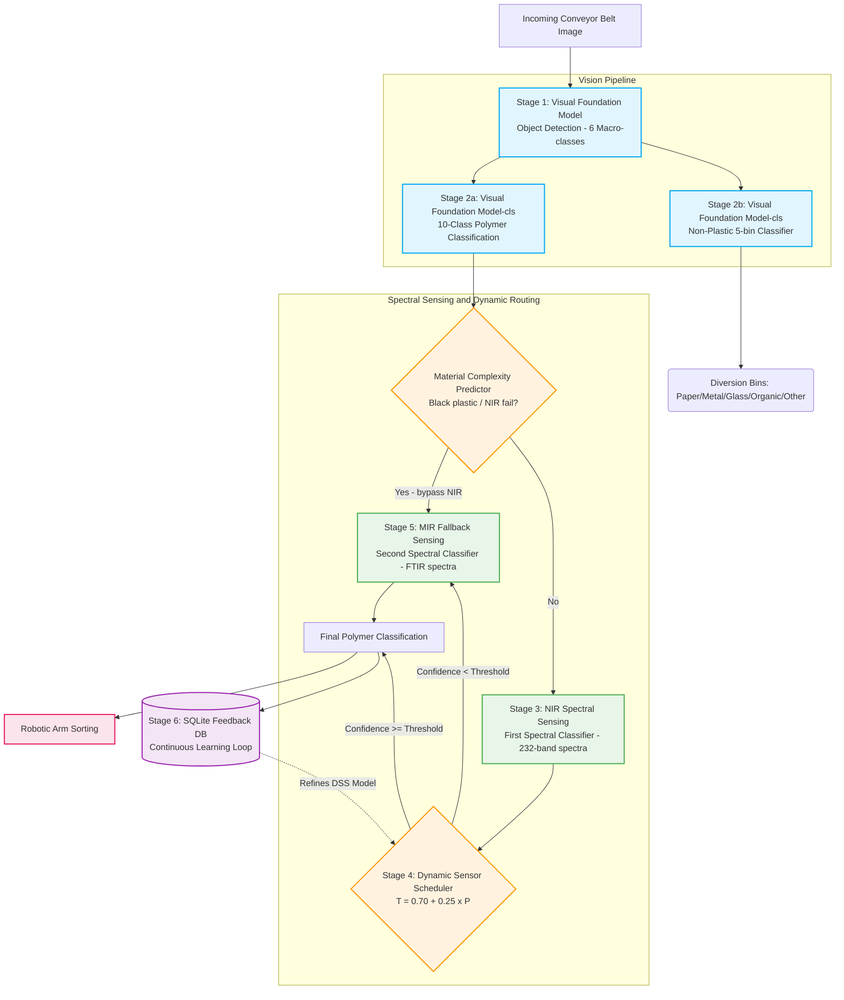

<div align="center">

# ♻️ AI + Sensor Based Plastic Waste Sorting System
### *Featuring the Dynamic Sensor Scheduler (DSS)*

[](https://www.python.org/downloads/release/python-3140/)
[](https://opensource.org/licenses/MIT)
[](paper/IEEE_Final_Paper.docx)

A state-of-the-art multimodal waste segregation system integrating deep learning computer vision with spectral sensing (NIR + MIR). The system introduces a novel **Dynamic Sensor Scheduler (DSS)** for intelligent sensor cascade management, significantly reducing energy consumption while maintaining peak sorting accuracy.

[Features](#-key-highlights) • [Architecture](#️-system-architecture) • [The Innovation](#-the-innovation) • [Results](#-results-summary) • [Quick Start](#-quick-start)

</div>

---

## 🌟 Key Highlights

- **🎯 95.7% Polymer Classification Accuracy** across 10 fine-grained categories via the Visual Foundation Model.
- **🗑️ 96.1% Non-Plastic Classification Accuracy** for robust diversion into 5 distinct bins.
- **🔍 97.12% NIR Spectral Identification** accuracy for primary polymer typing using the First Spectral Classifier.
- **🖤 99.0% MIR Recovery Rate** on challenging carbon-black plastics bypassing the primary sensor.
- **⚡ 39.1ms End-to-End Pipeline Latency** achieving true real-time performance on an Industrial Compute Node.
- **📉 60% Reduction in MIR Activations** via the intelligent Dynamic Sensor Scheduler routing.
- **🔋 45% Energy Savings** and a **2x Throughput Scale-Up** compared to traditional fixed-threshold sensing cascades.

---

## 🏗️ System Architecture

The project features a highly optimized, cascaded pipeline combining visual and spectral modalities.



### Stage Breakdown
1. **Stage 1 — Vision Detection:** A Visual Foundation Model detects waste objects on the conveyor belt, trained on 14,648 augmented images across 6 macro-classes.
2. **Stage 2a — Polymer Classification:** A secondary visual classifier predicts one of 10 fine-grained polymer categories (95.7% Top-1, 99.7% Top-5 accuracy).
3. **Stage 2b — Non-Plastic Sorting:** An independent branch routes non-plastics into 5 bins (Paper, Metal, Glass, Organic, Other) with 96.1% Top-1 accuracy.
4. **Stage 3 — NIR Spectral Sensing:** A First Spectral Classifier on 232-band NIR spectra achieves 97.12% accuracy on non-black plastics.
5. **Stage 4 — Dynamic Sensor Scheduler:** Computes an adaptive threshold `T = 0.70 + 0.25 × P(MIR_needed)` from a 17-feature context vector, cutting unnecessary MIR activations by 60%.
6. **Stage 5 — MIR Fallback:** A Second Spectral Classifier on FTIR spectra handles black and contaminated plastics (100% accuracy on clean samples; 99.0% on carbon-black HDPE).
7. **Stage 6 — Feedback Loop:** A SQLite database (`src/ace/feedback_db.py`) logs all predictions to continuously retrain the DSS in production.

---

## 🧠 The Innovation

The **Dynamic Sensor Scheduler (DSS)** is the core novelty of this system. Traditional sensor cascades use a fixed threshold to trigger expensive secondary sensors. DSS replaces this with a context-aware, adaptive boundary.

### The Problem: Fixed Thresholds
```python
# Traditional approach
if nir_confidence < 0.85:
    activate_mir_sensor()  # Costly, slow, and often unnecessary
else:
    accept_nir_prediction()
```

### The Solution: Dynamic Sensor Scheduler
```python
# DSS approach — actual code in src/ace/engine.py
context_vector = feature_extractor.extract(nir_data, visual_data, env_data)  # 17 features
adaptive_threshold = ace_engine.predict_threshold(context_vector)  # T = 0.70 + 0.25 × P

if nir_confidence < adaptive_threshold:
    activate_mir_sensor()
else:
    accept_nir_prediction()
```

---

## 📈 Results Summary

### Edge Deployment Benchmark
*Benchmarked on Industrial Compute Node (6 GB VRAM GPU)*

| Component | Input | Latency (ms) | FPS |
|:---|:---:|:---:|:---:|
| Visual Foundation Model Detection | 640×640 | 25.0 | ~40 |
| Visual Foundation Model-cls (Polymer) | 384×384 | 14.1 | ~71 |
| Visual Foundation Model-cls (Non-Plastic) | 224×224 | 12.5 | ~80 |
| First Spectral Classifier (NIR) | 232-band | <2 | >500 |
| Dynamic Sensor Scheduler | 17-feat | <1 | >1000 |
| Second Spectral Classifier (MIR) | 3736-band | <6.4 | >150 |
| **End-to-End per object** | — | **39.1** | **~25.6** |

### Black Plastic Recovery
Carbon-black plastics absorb NIR radiation, making them invisible to standard optical sorters. The MIR fallback stage recovers these:
- **Carbon-black HDPE:** NIR confidence 15.0% → MIR recovery **99.0%**
- **Standard PVC:** NIR confidence 89.87% → Correctly accepted (no MIR cost)

---

## 📁 Project Structure

```text
├── src/
│   ├── ace/                             # Dynamic Sensor Scheduler (DSS) module
│   │   ├── engine.py                    # Core adaptive threshold engine
│   │   ├── feature_extractor.py         # 17-feature context vector extractor
│   │   ├── synthetic_data.py            # Physics-based synthetic training data
│   │   ├── feedback_db.py               # SQLite continuous learning loop
│   │   ├── train_ace.py                 # Train DSS on synthetic data
│   │   └── evaluate_ace.py              # DSS vs Fixed Threshold comparison
│   ├── fusion/
│   │   └── cross_modal_attention.py     # Cross-modal attention prototype
│   ├── detect.py                        # Single-model webcam inference
│   ├── detect_combined.py               # Full dual-stage vision pipeline
│   ├── train.py                         # YOLO detection model training
│   ├── train_cls.py                     # Polymer classification model training
│   ├── train_detect_v2.py               # Detection model training v2
│   ├── train_nonplastic_cls.py          # Non-plastic 5-bin classifier training
│   ├── augment_detection_dataset.py     # Photometric dataset augmentation
│   ├── benchmark_edge.py                # Edge deployment latency benchmarking
│   ├── run_ablation.py                  # Ablation study framework
│   ├── generate_evaluation_plots.py     # Publication-quality result plots
│   ├── sanity_check.py                  # Pipeline sanity checks
│   ├── prepare_cls_dataset.py           # Classification dataset preparation
│   ├── validate.py                      # Model validation
│   └── unified_pipeline.py              # Grand unified multimodal pipeline
├── Atharva_NIR/                         # NIR/MIR Spectral Sensing Track
│   ├── preprocess.py                    # SNV normalization + Savitzky-Golay filter
│   ├── train_classical.py               # Spectral classifier training (SVM, RF)
│   ├── train_deep.py                    # Deep learning spectral models (1D-CNN, Transformer)
│   ├── extract_and_train_hsi.py         # HSI cube extraction and NIR model training
│   ├── evaluate_and_plot.py             # Evaluation plots for spectral models
│   ├── train_and_evaluate_pipeline.py   # Full NIR/MIR pipeline
│   ├── test_inference_demo.py           # Inference demo script
│   ├── models/                          # Pre-trained spectral model pickles
│   ├── plots/                           # Confusion matrices and spectral plots
│   └── results/                         # Validation metrics and reports
├── scripts/
│   ├── train_efp_model.py               # Train the Material Complexity Predictor
│   └── export_paper_metrics.py          # Export metrics for paper/report
├── models/                              # Trained model weights
│   ├── ace_xgboost.json                 # Trained Dynamic Sensor Scheduler model
│   ├── efp_predictor.pkl                # Material Complexity Predictor
│   ├── nir_hsi_model.pkl                # NIR First Spectral Classifier
│   ├── randomforest_model.pkl           # MIR Second Spectral Classifier
│   └── svm_model.pkl                    # Alternative NIR classifier
├── outputs/
│   ├── ace/                             # DSS evaluation plots and CSVs
│   ├── ablation/                        # Ablation study results
│   ├── benchmark/                       # Edge latency benchmark data
│   └── evaluation/                      # NIR threshold sweep and ablation plots
├── docs/
│   ├── PAPER_ALIGNMENT.md               # Paper vs code verification tracker
│   ├── efp_report.md                    # Material Complexity Predictor report
│   └── system_architecture.png          # System architecture diagram
├── paper/
│   └── IEEE_Final_Paper.docx            # IEEE-formatted research paper draft
├── results/                             # Spectral model training results
├── requirements.txt                     # Python dependencies
└── README.md                            # This file
```

---

## 🛠️ Installation & Setup

### Prerequisites
- Python 3.10+
- CUDA 12.x (for GPU acceleration, optional)

### Setup
```bash
# Clone the repository
git clone https://github.com/VyankateshDawale/Plastic-Segregation.git
cd Plastic-Segregation

# Create and activate virtual environment
python -m venv venv

# Windows
venv\Scripts\activate
# Linux/macOS
source venv/bin/activate

# Install dependencies
pip install --upgrade pip
pip install -r requirements.txt
```

---

## 🚀 Quick Start

### 1. Run the Full Unified Multimodal Pipeline
```bash
python -m src.unified_pipeline
```

### 2. Evaluate the Dynamic Sensor Scheduler vs Fixed Threshold
```bash
python -m src.ace.evaluate_ace
```
*Generates comparison plots in `outputs/ace/`*

### 3. Train the Dynamic Sensor Scheduler
```bash
python -m src.ace.train_ace
```

### 4. Train the Material Complexity Predictor (EFP)
```bash
python scripts/train_efp_model.py
```

### 5. Edge Benchmarking
```bash
python src/benchmark_edge.py
```

### 6. Run NIR/MIR Spectral Training
```bash
python Atharva_NIR/train_and_evaluate_pipeline.py
```

---

## 📖 Citation

If you use this code or the Dynamic Sensor Scheduler methodology in your research, please cite our IEEE paper:

```bibtex
@inproceedings{dawale2026dss,
  title={Multimodal AI-Driven Waste Segregation: Integrating Dual-Stage Visual Foundation Model Deep Learning with an Adaptive Confidence-Gated NIR-MIR Sensor Cascade},
  author={Dawale, Vyankatesh and Chaudhari, Pratyush and Dhakne, Atharva},
  booktitle={IEEE Conference on Automation and Computing (ACE)},
  year={2026},
  organization={IEEE}
}
```

---

## 📄 License

This project is licensed under the MIT License.

<div align="center">
  <sub>Built with ❤️ for a greener planet.</sub>
</div>
